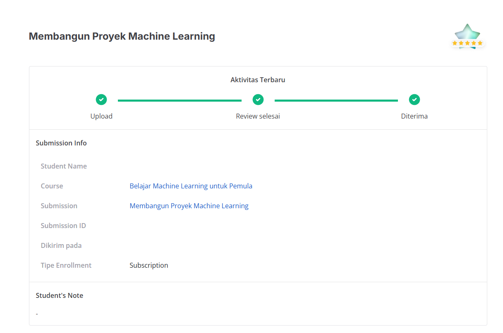

# Dicoding - Belajar Machine Learning untuk Pemula

## Penilaian Proyek
Proyek ini berhasil mendapatkan bintang 5/5 pada submission dicoding course Belajar Machine Learning untuk Pemula.



[](https://www.python.org/)
[](https://scikit-learn.org/)
[](LICENSE)
[-brightgreen.svg)](#)

---

## Deskripsi Project
Project ini adalah submission untuk kelas Dicoding **Belajar Machine Learning untuk Pemula (BMLP)**. Isi project mengintegrasikan dua paradigma utama machine learning secara berkesinambungan (*end-to-end*):

1. **Unsupervised Learning (Clustering)** menggunakan K-Means untuk segmentasi transaksi nasabah perbankan dan menghasilkan label kelas target.
2. **Supervised Learning (Klasifikasi)** menggunakan Decision Tree dan Random Forest (disertai Hyperparameter Tuning) untuk memprediksi segmen nasabah berdasarkan atribut transaksi dan demografi.

Seluruh kriteria penilaian telah dipenuhi hingga tingkat tertinggi: **Advanced (Bintang 5 / 4.0 Poin)**.

---

## Daftar Isi
- [Struktur Repositori](#struktur-repositori)
- [Gambaran Dataset](#gambaran-dataset)
- [Tahapan Proyek](#tahapan-proyek)
  - [1. Clustering (Unsupervised Learning)](#1-clustering-unsupervised-learning)
  - [2. Klasifikasi (Supervised Learning)](#2-klasifikasi-supervised-learning)
- [Hasil dan Evaluasi](#hasil-dan-evaluasi)
- [Instalasi dan Setup](#instalasi-dan-setup)
- [Panduan Menjalankan Notebook](#panduan-menjalankan-notebook)
- [Ketentuan Berkas Submission](#ketentuan-berkas-submission)

---

## Struktur Repositori

```text
Dicoding-BelajarMachineLearningUntukPemula/
├── README.md                                             # Dokumentasi lengkap proyek
├── requirements.txt                                      # Dependensi pustaka Python
├── readme/
│   └── nilai.png                                         # Bukti penilaian bintang 5 submission Dicoding
└── BMLP_Muhammad-Abiya-Makruf/                           # Direktori submission proyek machine learning
    ├── [Clustering]_Submission_Akhir_BMLP_Muhammad_Abiya_Makruf.ipynb   # Notebook Clustering (Terevaluasi)
    ├── [Klasifikasi]_Submission_Akhir_BMLP_Muhammad_Abiya_Makruf.ipynb  # Notebook Klasifikasi (Terevaluasi)
    ├── data_clustering.csv                               # Data hasil clustering terstandarisasi
    ├── data_clustering_inverse.csv                       # Data hasil clustering skala asli (Advanced)
    ├── model_clustering.h5                               # Model K-Means Clustering utama
    ├── PCA_model_clustering.h5                           # Model K-Means berbasis PCA (Advanced)
    ├── decision_tree_model.h5                            # Model Decision Tree Klasifikasi
    ├── explore_RandomForest_classification.h5           # Model Random Forest Klasifikasi (Skilled)
    └── tuning_classification.h5                          # Model Random Forest hasil Tuning (Advanced)
```

---

## Gambaran Dataset

Dataset yang digunakan merupakan modifikasi dari *Bank Transaction Dataset for Fraud Detection* (Kaggle) yang terdiri dari **2.512 baris data** dan **16 atribut**:
* **Atribut Identitas & Waktu:** `TransactionID`, `AccountID`, `TransactionDate`, `PreviousTransactionDate`, `DeviceID`, `IP Address`, `MerchantID`. *(Dihapus saat pra-pemrosesan karena bersifat identitas non-prediktif)*.
* **Fitur Numerik:** `TransactionAmount`, `CustomerAge`, `TransactionDuration`, `LoginAttempts`, `AccountBalance`.
* **Fitur Kategorikal:** `TransactionType`, `Location`, `Channel`, `CustomerOccupation`.

---

## Tahapan Proyek

### 1. Clustering (Unsupervised Learning)
* **Exploratory Data Analysis (EDA):**
  * Menampilkan informasi awal (`.head()`, `.info()`, `.describe()`).
  * Korelasi matriks (*Heatmap*) antar fitur numerik.
  * Distribusi histogram untuk seluruh fitur numerik.
  * Visualisasi *Boxplot* nominal transaksi per pekerjaan nasabah dengan perputaran label ($45^\circ$) agar tidak overlap.
* **Pembersihan & Pra-pemrosesan Data:**
  * Penghapusan nilai *missing* (`dropna(inplace=True)`) dan data duplikat (`drop_duplicates(inplace=True)`).
  * Penghapusan kolom identitas (ID, Date, IP Address).
  * Encoding fitur kategorikal menggunakan `LabelEncoder()`.
  * Penanganan *outliers* pada fitur numerik menggunakan metode **Interquartile Range (IQR)** drop.
  * Standarisasi fitur numerik menggunakan `StandardScaler()`.
  * *Data Binning* pada fitur `CustomerAge` menjadi 3 kuantil (Muda, Paruh Baya, Lansia) dan dienkode kembali dengan `LabelEncoder()` *(Kriteria Advanced)*.
* **Pemodelan & Visualisasi:**
  * Penentuan jumlah cluster optimal menggunakan **Elbow Method (KElbowVisualizer)** dengan metrik Silhouette ($k=2$).
  * Pelatihan algoritma `KMeans(n_clusters=2, random_state=42)`.
  * Perhitungan nilai **Silhouette Score**.
  * Visualisasi reduksi dimensi 2D menggunakan **PCA (Principal Component Analysis)** beserta titik centroid.
  * Pelatihan model pembanding K-Means langsung pada komponen PCA (`PCA_model_clustering.h5`) *(Kriteria Advanced)*.
* **Interpretasi & Ekspor Data:**
  * Analisis agregasi deskriptif (`mean`, `min`, `max`) per cluster pada kondisi terstandarisasi.
  * Pengembalian nilai fitur ke skala dan label aslinya menggunakan `inverse_transform()`.
  * Analisis agregasi deskriptif pada skala asli (numerik: `mean`, `min`, `max`; kategorikal: `mode`).
  * Penyusunan persona bisnis untuk tiap segmen cluster.
  * Ekspor dataset hasil clustering (`data_clustering.csv` dan `data_clustering_inverse.csv`).

### 2. Klasifikasi (Supervised Learning)
* **Persiapan Data:**
  * Memuat dataset `data_clustering_inverse.csv` yang memiliki kolom target `Target`.
  * Mengonversi variabel kategorikal menjadi representasi biner dengan **One-Hot Encoding** (`pd.get_dummies(..., drop_first=True)`).
  * Membagi data menjadi *train set* (80%) dan *test set* (20%) secara terstratifikasi (`stratify=y`) untuk menjaga proporsi kelas.
* **Pemodelan Klasifikasi:**
  * **Model Baseline:** `DecisionTreeClassifier(random_state=42)`.
  * **Model Pembanding:** `RandomForestClassifier(random_state=42)` *(Kriteria Skilled)*.
* **Hyperparameter Tuning:**
  * Menggunakan `GridSearchCV` dengan 5-Fold Cross Validation untuk menemukan parameter terbaik pada model Random Forest (`n_estimators`, `max_depth`, `min_samples_split`) *(Kriteria Advanced)*.
* **Evaluasi:**
  * Pengukuran metrik performa komprehensif (*Accuracy*, *Precision*, *Recall*, *F1-Score*) pada testing set menggunakan `classification_report()`.

---

## Hasil dan Evaluasi

### Karakteristik Cluster Hasil Segmentasi
1. **Cluster 0: Segmen Profesional Mapan / Paruh Baya**
   * Usia rata-rata: **45.06 tahun** (rentang 18–80 tahun).
   * Saldo rekening rata-rata: **\$5,142.17** (tertinggi).
   * Durasi transaksi: **121.12 detik**.
   * Profil dominan: Profesi **Dokter (Doctor)**, transaksi **Debit** melalui **Branch (Kantor Cabang)**, berlokasi di Charlotte.
   * *Rekomendasi:* Produk investasi reksa dana/obligasi stabil, tabungan berjangka, dan asuransi kesehatan premium.
2. **Cluster 1: Segmen Generasi Muda / Pelajar Dinamis**
   * Usia rata-rata: **44.33 tahun** (kelompok usia Muda).
   * Nilai transaksi rata-rata: **\$258.15** (sedikit lebih tinggi dibanding Cluster 0).
   * Durasi transaksi: **117.30 detik** (transaksi lebih cepat).
   * Saldo rekening rata-rata: **\$5,058.81**.
   * Profil dominan: Profesi **Mahasiswa (Student)**, transaksi **Debit** melalui **Branch**, berlokasi di Tucson.
   * *Rekomendasi:* Layanan mobile banking inovatif, cashback/reward transaksi harian, dan program edukasi finansial.

### Performa Model Klasifikasi

| Model | Accuracy | Precision (Macro) | Recall (Macro) | F1-Score (Macro) | Berkas Model |
| :--- | :---: | :---: | :---: | :---: | :--- |
| **Decision Tree** | 1.00 | 1.00 | 1.00 | 1.00 | `decision_tree_model.h5` |
| **Random Forest** | 1.00 | 1.00 | 1.00 | 1.00 | `explore_RandomForest_classification.h5` |
| **Tuned Random Forest** | 1.00 | 1.00 | 1.00 | 1.00 | `tuning_classification.h5` |

---

## Instalasi dan Setup

1. **Clone repositori:**
   ```bash
   git clone https://github.com/AbiyaMakruf/Dicoding-BelajarMachineLearningUntukPemula.git
   cd Dicoding-BelajarMachineLearningUntukPemula
   ```

2. **Buat virtual environment (disarankan):**
   ```bash
   python -m venv .venv
   # Windows
   .venv\Scripts\activate
   # Linux / macOS
   source .venv/bin/activate
   ```

3. **Install dependensi pustaka:**
   ```bash
   pip install -r requirements.txt
   ```
   > **Catatan:** Sesuai panduan submission Dicoding, gunakan `scikit-learn` versi 1.7.x agar kompatibel dengan modul visualisasi `yellowbrick` dan validator penilaian.

---

## Panduan Menjalankan Notebook

Notebook dapat dijalankan secara interaktif menggunakan Jupyter Notebook, JupyterLab, VS Code, atau Google Colab:

1. Buka dan jalankan seluruh cell pada notebook **Clustering**:
   ```bash
   jupyter notebook "BMLP_Muhammad-Abiya-Makruf/[Clustering]_Submission_Akhir_BMLP_Muhammad_Abiya_Makruf.ipynb"
   ```
   *Proses ini akan menghasilkan `data_clustering.csv`, `data_clustering_inverse.csv`, `model_clustering.h5`, dan `PCA_model_clustering.h5`.*

2. Buka dan jalankan seluruh cell pada notebook **Klasifikasi**:
   ```bash
   jupyter notebook "BMLP_Muhammad-Abiya-Makruf/[Klasifikasi]_Submission_Akhir_BMLP_Muhammad_Abiya_Makruf.ipynb"
   ```
   *Proses ini membaca `data_clustering_inverse.csv` dan menghasilkan `decision_tree_model.h5`, `explore_RandomForest_classification.h5`, serta `tuning_classification.h5`.*

---

## Ketentuan Berkas Submission

Untuk mengumpulkan tugas ke platform Dicoding, arsipkan berkas-berkas berikut ke dalam format ZIP bernama `BMLP_Nama-siswa.zip`:
* `[Clustering]_Submission_Akhir_BMLP_Your_Name.ipynb` *(Wajib)*
* `[Klasifikasi]_Submission_Akhir_BMLP_Your_Name.ipynb` *(Wajib)*
* `model_clustering.h5` *(Wajib)*
* `decision_tree_model.h5` *(Wajib)*
* `data_clustering.csv` *(Wajib)*
* `PCA_model_clustering.h5` *(Opsional - Kriteria Advanced)*
* `explore_RandomForest_classification.h5` *(Opsional - Kriteria Skilled)*
* `tuning_classification.h5` *(Opsional - Kriteria Advanced)*
* `data_clustering_inverse.csv` *(Opsional - Kriteria Advanced)*
